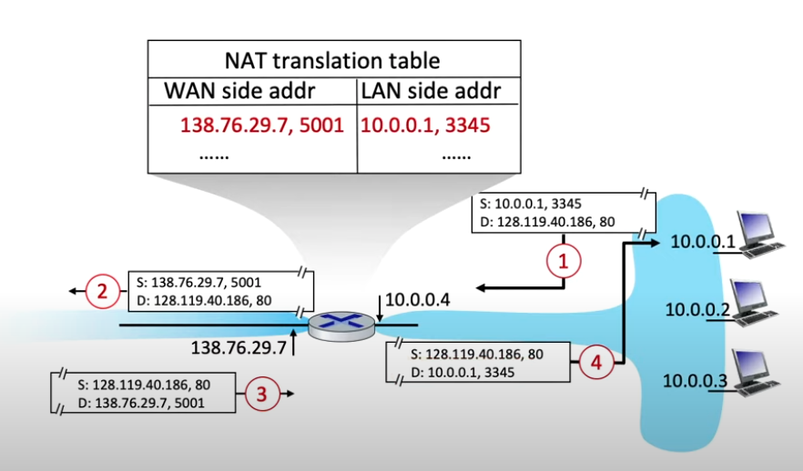

# Network Layer

The previous layers are implemented in the edges of the connection  
Now, the network layer is implemented in every device connected to the internet  
It makes the network the most interesting layer to learn  
Its main protocol is called IP, which stands for Internet Protocol

## Router

## Internet Protocol

### IP Datagram

#### Issues

- Need to compute the checksum in every router, since the counter field decrements

### Subnet

A subnet is a set of devices interfaces that can physically reach each router without passing through an intervening router  
A local IP address has a subnet mask, which defines the amount of high order bytes used to identify the subnet  
The remaining bits are used to identify the host within the subnet

When your device communicates within the local network (same subnet), the destination IP address is recognized as belonging to the same network. This is determined using the subnet mask.  
In such cases, the device sending the data does not need to forward the packet to the router (the default gateway). Instead, it sends the data to the switch, which will handle the local forwarding using MAC addresses.  
If a device wants to communicate with a device outside the local network (e.g., 10.0.0.1 or the internet), the packet would be sent to the router (default gateway). The router would then direct the traffic out of the local network to the appropriate destination.

#### Reserved local ip addresses

##### Network Address

This is the first IP address in the subnet and is used to identify the network itself. In a 192.168.1.0/24 network, this address is 192.168.1.0. It represents the network and cannot be assigned to a device.

##### Broadcast Address

This is the last IP address in the subnet and is used to send messages to all devices on the network. In a 192.168.1.0/24 network, this address is 192.168.1.255.

##### Default Gateway

Typically, the first usable IP address in the subnet is assigned to the default gateway. In a 192.168.1.0/24 network, this address is 192.168.1.1

#### Increasing the length of a subnet

You can use a smaller subnet mask to accommodate more IP addresses.

With a 24-bit subnet mask (255.255.255.0), there are 2^8−2=254 usable IP addresses (subtracting 2 for the network and broadcast addresses).  
If you need more than 254 hosts, you can reduce the number of subnet bits, thus increasing the host portion.

#### How does a host get a local IP address?

Using DHCP Protocol

##### DHCP

DHCP, which stands for Dynamic Host Configuration Protocol, is a protocol used by the host to get a local IP address within the network  
Typically the DHCP server will be running in the router, serving all subnets to which the router is attached  
The host sends a broadcast, which will be responded by the DHCP server with an offer of a local IP address to be used by the host  
The host then responds saying it wants to use that IP address

#### How does a router get a public IP address?

Each ISP has an address space  
The ISP can then use the remaining bits to identify their public networks

##### Example

The ISP might be assigned a block like 203.0.113.0/24.  
This CIDR block means that the ISP owns the range of IP addresses from 203.0.113.0 to 203.0.113.255.  
A home user might get a single public IP address and use NAT on their router to allow multiple devices on their internal network to share that one public IP.

### NAT

To solve the problem of IPv4 address space exhaustion, NAT, Network Address Translation, was developed  
NAT has been controversial, specially because it manipulates ports, which should be manipulated only in the end devices

  

## Middleboxes

